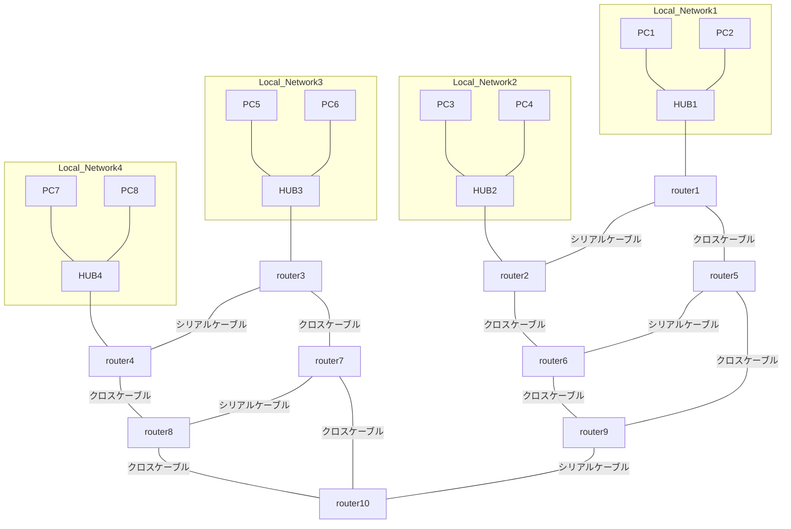

# 情報通信工学実験実習 III (情報工学)

## 更新履歴

| 版 | 日付 | 内容 |
| --- | --- | --- |
| 1.0 | 2026-04-10 | 初版作成 |

## 情報工学 (1) ケーブル作成とネットワークパフォーマンス測定

### 1 目的
ネットワークケーブルとしてもっともよく使用されているツイストペアケーブルの構造を理解し、実際に作成する。また、コンピュータネットワークにおいて、ハブ(リピータハブ、スイッチングハブ)の役割を理解し、ネットワークパフォーマンスを測定する。

### 2 理論
#### 2.1 ツイストペアケーブル
通常、UTPケーブル(shielded Twist Pair cab)はRJ-45コネクタで結線される。
RJ-45コネクタはオス型コンポーネントであり、ケーブルの端部に圧着される。
オス型コネクタを金属製の接合部を下にして前面から見た場合、
左から順に1番から 8番までのピン番号が割り振られている。
ジャックはメス型コンポーネントと考えることができる。
それらはネットワークデバイスや壁の差込口にあり、ケーブルのRJ-45コネクタをジャックに差し込むことで接続される。

圧着工具を使用すれば自分でも結線でき、ノイズを少なくするためによりを戻すケーブルの長さを短くし、
ケーブルをコネクタに完全に差し込んで被覆に圧着するようにする。
これにより十分な電気接合としっかりとした導線接続が得られる。

#### 2.2 CSMA/CD (Carrier Sense Multiple Access with Collision Detection)
搬送波感知多重アクセス/衝突検出方式。
CSMA/CDはLANで利用される通信方式の1つで、Ethernetが採用している。
データを送信したいコンピュータはケーブルの通信状況を監視し(Carrier Sense)、ケーブルが空くと送信を開始する。
衝突が起きた場合は(Collision Detection)、両者は送信を中止し、ランダムな時間待って送信を再開する。
無線LANの場合は、CSMA/CA(衝突回避)を利用し、送信前に一定時間待機することで衝突をなるべく回避する。

#### 2.3 物理アドレス、論理アドレス
* MACアドレス (物理アドレス): すべてのイーサネットネットワークインターフェイスは、製造段階で割り当てられた48bitのMACアドレスを持っている。2桁の16進数の6つの組合せで表される。
* IPアドレス (論理アドレス): IPネットワークでメッセージの送受信を行うために割り当てられる一意の32ビットアドレス。人間が識別しやすいように、10進数に変換してドットで区切って表記される（例: 192.168.1.106）。

#### 2.4 ネットワーク接続機器
ネットワークを接続するための機器として、ハブとルータがある。

* リピータハブ: 1つのポートから受信したデータをそのまま他のすべてのポートに送信する。
* スイッチングハブ: MACアドレステーブルを持ち、送信元ポートと宛先ポートの間に回線と呼ばれる一時的な接続を作成するため、衝突が発生しない。
* ルータ: IPアドレスを元にネットワークとネットワークを接続する。ルータとスイッチングハブの両方の機能を持つL3スイッチも存在する。

### 3 実験・実習

#### 3.1 ネットワークケーブル(ストレート)作成
1. ワイヤストリッパを使って、約5 cm被覆を取り除く。
2. 規格(T568B配線)にしたがって、ケーブルをまっすぐに伸ばしながら色の順番に並べる（白橙、橙、白緑、青、白青、緑、白茶、茶）。
3. ケーブルを約1.5 cmに切断し、RJ-45コネクタに挿入する。
4. 圧着工具で圧着し、反対側も同様に作成後、ケーブルテスタで接続を確認する。


出典: <https://commons.wikimedia.org/wiki/File:568_A_and_568_B.svg>


| ピン番号 | 線の色 |
| :---: | :--- |
| 1 | 白橙 |
| 2 | 橙 |
| 3 | 白緑 |
| 4 | 青 |
| 5 | 白青 |
| 6 | 緑 |
| 7 | 白茶 |
| 8 | 茶 |


RJ-45コネクタを正面（金属製の接合部を下にした前面）から見た場合、左から右へこの順番（1番から8番）に並べて挿入する。

#### 3.2 ネットワークパフォーマンス測定
1. リピータハブ: 自作したケーブルで1つのハブにつき6台(程度)のコンピュータを接続し、`ifconfig`コマンドで物理アドレスと論理アドレスを調べる。複数間で個別に、または同時に転送速度を測る。
2. 
3. スイッチングハブ: ハブをスイッチングハブに替え、同様にパフォーマンスを測定する。
4. 無線LAN: ハブを無線LANアクセスポイントおよびコンバータに替え、同様に測定する。

##### 測定法
サーバー側で `./netserver` を起動し、スレーブ側で `./netperf -H <Server-IP>` と入力して測定する（10秒間でThroughputが得られる）。

##### 結果と考察のまとめ方
* ネットワークパフォーマンスの結果を表にまとめ、考察せよ（3回の平均を計算すること）。

### 4. 課題
1. ツイストペアケーブルが4対に分かれ、それぞれが撚ってある理由を調べよ。
2. CSMA/CDとCSMA/CAの具体的な違いは何か。
3. スイッチングハブで衝突が発生しない理由は何か。


---

## 情報工学 (2) ルータの設定とルートの確認

### 1 目的
コンピュータネットワークにおいて、IPアドレス、ルータの役割を理解し、ルータの設定の仕方を学習し、ルータによるルーティングを確認する。

### 2 理論、ルータ設定法
#### 2.1 ルータの役割
ルータはローカルネットワークを相互接続するデバイスであり、宛先IPアドレスのネットワーク部を読み取り、どのネットワークにメッセージを転送すればもっとも効率的に宛先に届くかを判断する。
ルータには、ローカル接続ネットワークやリモートネットワークへメッセージを送信するためのルート(経路)情報が格納されたルーティングテーブルがある。

#### 2.2 ルータの設定
パソコンとルータをコンソールケーブルで接続し、ターミナルエミュレータを使ってCisco IOSで設定する。

* ユーザEXECモード (`Router>`): デバイスの動作状態調べや`ping`、`traceroute`のみ可能。
* 特権EXECモード (`Router#`): `enable`コマンドで移行し、設定コマンドへのアクセスが可能。
* グローバル設定モード (`Router(config)#`): `configure terminal`コマンドで移行し、インターフェイス設定等を行う。

#### 2.3 RIP (Routing Information Protocol)
パス選択のメトリックとしてホップカウントを使用するルーティングプロトコル。ルーティングテーブルの内容をデフォルトで30秒ごとに送信し、新しいルートの情報を隣接ルータに通知する。

##### 設定コマンド例

```text
Router(config)# router rip
Router(config-router)# network [network-number]
```

設定後、リモートネットワークのデバイスへ `ping` を実行したり、`show ip route` コマンドでルーティングテーブルを確認して動作を検証する。

#### 2.4 ルータ・Linuxコマンドまとめ

* ルータ: `enable`（特権モードへ）、`configure terminal`（設定モードへ）、`interface [IF-Name]`（IF設定へ）、`ip address [Address] [Mask]`、`no shutdown`（IF有効化）、`show interfaces`、`show ip route`、`show run`など。
* Linux: `su`（管理者モード）、`ifconfig eth0 [IP] netmask [Mask]`、`route add default gw [GW-IP]`。

### 3 実験
#### 3.1 ネットワークの設計
接続にしたがってネットワークアドレスとサブネットマスクを決定し、すべてのインターフェイスにIPアドレスを割り当てる。

#### 3.2 ルータのインタフェース設定
PCとルータをコンソールケーブルで接続し、ターミナルで `cu -s 9600 -1 /dev/ttyUSB0` 等のコマンドで接続する。ルータのイーサネットインターフェイスにIPアドレスを設定し、他のルータへ `ping` で接続確認する。

#### 3.3〜3.5 最終配線とルータ・PC設定
各機器をストレートケーブルやシリアルケーブル、クロスケーブルで配線する。PCおよびルータの各インターフェイスのIPアドレス設定、デフォルトルートの設定を行う。

#### 3.6 接続確認1
`ping`コマンドで、直近のルータ、グループ内のすべてのルータ間、別ネットワークのPCへの到達性を確認する。

#### 3.7 RIPによる接続確認2
すべてのルータにRIPを設定後、数分待ってから各種接続確認や `traceroute` を実行し、各自のルーティングテーブルを記録する。

#### 3.8 ケーブルを一部外して接続確認3
ネットワークが一部不達になったことを想定してクロスケーブルを外し、同様に `traceroute` およびルーティングテーブルの変化を調べる。

### 4 課題
1. 3回(3.6, 3.7, 3.8)の接続確認を表にまとめ、届かなかった場合はその理由を考えよ。
2. 2回(3.7, 3.8)の `traceroute` を比較せよ。
3. ルーティングテーブルを考察せよ。

### ネットワーク図


