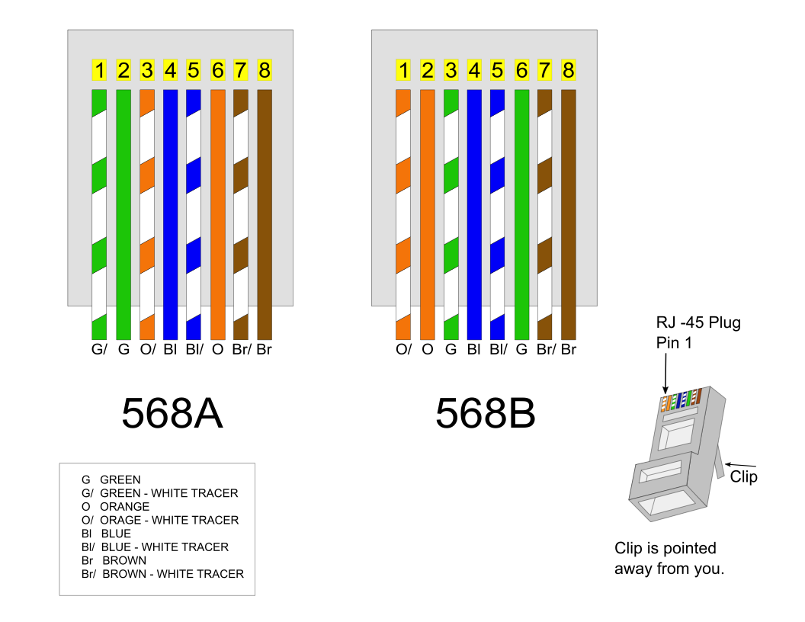

# 情報工学1 ~ケーブル作成とネットワークパフォーマンス測定~

本実験は1回分（4時限分）を想定している。
実験レポートのファイル名は `T4情報工学1_[学生番号]_[氏名].pdf` とすること。

## 1. 目的
ネットワークケーブルとしてもっともよく使用されているツイストペアケーブルの構造を理解し、実際に作成する。また、コンピュータネットワークにおいて、ハブ(リピータハブ、スイッチングハブ)の役割を理解し、ネットワークパフォーマンスを測定する。

## 2. 理論
### 2.1 ツイストペアケーブル
通常、UTPケーブル(shielded Twist Pair cab)はRJ-45コネクタで結線される。
RJ-45コネクタはオス型コンポーネントであり、ケーブルの端部に圧着される。
オス型コネクタを金属製の接合部を下にして前面から見た場合、
左から順に1番から 8番までのピン番号が割り振られている。
ジャックはメス型コンポーネントと考えることができる。
それらはネットワークデバイスや壁の差込口にあり、ケーブルのRJ-45コネクタをジャックに差し込むことで接続される。

圧着工具を使用すれば自分でも結線でき、ノイズを少なくするためによりを戻すケーブルの長さを短くし、
ケーブルをコネクタに完全に差し込んで被覆に圧着するようにする。
これにより十分な電気接合としっかりとした導線接続が得られる。

### 2.2 CSMA/CD (Carrier Sense Multiple Access with Collision Detection)
搬送波感知多重アクセス/衝突検出方式。
CSMA/CDはLANで利用される通信方式の1つで、Ethernetが採用している。
データを送信したいコンピュータはケーブルの通信状況を監視し(Carrier Sense)、ケーブルが空くと送信を開始する。
衝突が起きた場合は(Collision Detection)、両者は送信を中止し、ランダムな時間待って送信を再開する。

### 2.3 CSMA/CA (Carrier Sense Multiple Access with Collision Avoidance)
無線LANでは送信中に衝突を直接検出しにくいため、CSMA/CA（衝突回避）を利用する。
端末はまずチャネルの利用状況を確認し、一定時間（IFS）待機した後、ランダムなバックオフ時間を設けてから送信する。
もし他端末の送信を検知した場合はバックオフを延長して再試行し、同時送信の確率を下げる。
また、受信側からACK（受信確認）を返すことで、フレームが正しく届いたかを確認する。必要に応じてRTS/CTSを使い、隠れ端末問題による衝突も軽減する。

### 2.4 物理アドレス、論理アドレス
本資料で「IPアドレス」と記す場合は、とくに注記がない限りIPv4を指す。

* MACアドレス (物理アドレス): すべてのイーサネットネットワークインターフェイスは、製造段階で割り当てられた48bitのMACアドレスを持っている。2桁の16進数の6つの組合せで表される。
* IPアドレス (論理アドレス): IPネットワークでメッセージの送受信を行うために割り当てられる32ビットアドレス。一般に「ネットワーク部」と「ホスト部」に分かれ、10進数に変換してドットで区切って表記する（例: 192.168.1.106）。
* サブネットマスク: IPアドレスのどこまでがネットワーク部かを示す値。ネットワーク部は1、ホスト部は0で表される（例: 255.255.255.0）。CIDR表記では、先頭から連続する1のビット数を `/24` のように表す（例: `255.255.255.0 = /24`）。
  サブネットマスクが必要になった理由は、IPアドレスだけでは「どこまでがネットワーク部か」を一意に判定できないためである。組織ごとにネットワークを細かく分割し、アドレス空間をムダなく使い、ルータが適切に経路選択できるようにするために用いられる。
* ネットワークアドレス: 同一ネットワーク全体を表すアドレス。IPアドレスとサブネットマスクをビットごとにAND演算して求める。
  例として、`192.168.1.106/255.255.255.0` のネットワークアドレスは `192.168.1.0` となる。

CIDR・サブネットマスク早見表:

| CIDR | サブネットマスク  | ホスト部ビット数 | 1サブネットあたり利用可能ホスト数 |
| :--: | :---------------- | :--------------: | --------------------------------: |
| /8   | 255.0.0.0         | 24               |                        16,777,214 |
| /16  | 255.255.0.0       | 16               |                            65,534 |
| /24  | 255.255.255.0     | 8                |                               254 |
| /25  | 255.255.255.128   | 7                |                               126 |
| /26  | 255.255.255.192   | 6                |                                62 |
| /27  | 255.255.255.224   | 5                |                                30 |
| /28  | 255.255.255.240   | 4                |                                14 |
| /29  | 255.255.255.248   | 3                |                                 6 |
| /30  | 255.255.255.252   | 2                |                                 2 |

* プライベートアドレス:
  組織内LANで利用するために予約されたIPv4アドレス。インターネット上ではそのままルーティングされない。
  クラス分類の対応でみると、Class A 相当が `10.0.0.0/8`、Class B 相当が `172.16.0.0/12`、Class C 相当が `192.168.0.0/16` である。
  現在の実運用はクラスレス（CIDR）が前提だが、範囲を覚える際にA/B/Cの呼び方が使われることがある。
* NAT (Network Address Translation):
  ルータやファイアウォールでIPアドレスを書き換える技術。内部のプライベートアドレスを外部のグローバルアドレスへ変換し、外部ネットワークと通信できるようにする。
* IPマスカレード:
  NATの一種（多対一変換、NAPT/PAT）。複数の内部端末が1つのグローバルIPアドレスを共有できるように、送信元ポート番号も合わせて変換・管理する。

例として、複数PC（192.168.1.x）が家庭用ルータを経由してインターネットに接続する場合、外部からはルータの1つのグローバルIPアドレスとして見える。

### 2.5 ネットワーク接続機器
ネットワークを接続するための機器として、ハブとルータがある。

* リピータハブ: 1つのポートから受信したデータをそのまま他のすべてのポートに送信する。
* スイッチングハブ: MACアドレステーブルを持ち、送信元ポートと宛先ポートの間に回線と呼ばれる一時的な接続を作成するため、衝突が発生しない。
* ルータ: IPアドレスを元にネットワークとネットワークを接続する。ルータとスイッチングハブの両方の機能を持つL3スイッチも存在する。

## 3. 実験・実習

### 3.1 ネットワークケーブル（ストレート）の作成
1. ワイヤストリッパを使って、約5 cm被覆を取り除く。
2. ANSI/TIA-568規格(T568B配線)にしたがって、ケーブルをまっすぐに伸ばしながら色の順番に並べる（白橙、橙、白緑、青、白青、緑、白茶、茶）。
3. ケーブルを約1.5 cmに切断し、RJ-45コネクタに挿入する。
4. 圧着工具で圧着し、反対側も同様に作成後、ケーブルテスタで接続を確認する。

出典: <https://commons.wikimedia.org/wiki/File:568_A_and_568_B.svg>

| ピン番号 | 線の色 |
| :------: | :----- |
|    1     | 白橙   |
|    2     | 橙     |
|    3     | 白緑   |
|    4     | 青     |
|    5     | 白青   |
|    6     | 緑     |
|    7     | 白茶   |
|    8     | 茶     |

RJ-45コネクタを正面（金属製の接合部を下にした前面）から見た場合、左から右へこの順番（1番から8番）に並べて挿入する。

### 3.2 リピータハブを使ったネットワークパフォーマンス（転送速度）測定
0. 各PCのイーサネットケーブルを抜き、校内LANから抜ける
0. Linuxを起動する(電源を入れてF9キー)
1. 自作したケーブルで1つのハブにつき6台(程度)のコンピュータ（PC1, PC2, ...）を接続する。各PCのIPアドレスを適切に設定し、同一のネットワークに参加できるように設計する。レポートの実験項にはネットワーク図を用意すること。
2. `ifconfig`コマンドで物理アドレスと論理アドレスを調べる。ネットワーク上の各PCに `ping`コマンドを発行し、接続できていることを確認する。
3. PCの組み合わせ(例: PC1-PC2, PC3-PC4, PC5-PC6)間で **個別に** ネットワークパフォーマンスを測定する。ネットワークパフォーマンスの測定と結果・考察のまとめ方は下記を参照すること。以下の測定でも同様である。
4. すべてのPCの組み合わせで同時にネットワークパフォーマンスを測る。これで輻輳したときのネットワークパフォーマンスがわかる。

### 3.3 スイッチングハブを使ったネットワークパフォーマンス（転送速度）測定
ハブをスイッチングハブに替え、上記と同様にパフォーマンスを測定する。

### 3.4 無線LANを使ったネットワークパフォーマンス（転送速度）測定
ハブを無線LANアクセスポイントおよびコンバータに替え、同様に測定する。
実際に使用したネットワークに応じて、レポートの実験項にネットワーク図を用意するのを忘れないこと。

#### ネットワークパフォーマンス測定法
サーバー側で `./netserver` を起動し、スレーブ側で `./netperf -H [Server-IP]` と入力して測定する（10秒間でThroughputが得られる）。

#### 結果と考察のまとめ方
ネットワークパフォーマンスを3回測定し、その結果とその結果から得られた平均を表にまとめ、考察せよ。

## 4. 課題
1. ツイストペアケーブルが4対に分かれ、それぞれが撚ってある理由を調べよ。
2. CSMA/CDとCSMA/CAの具体的な違いは何か。
3. スイッチングハブで衝突が発生しない理由は何か。
