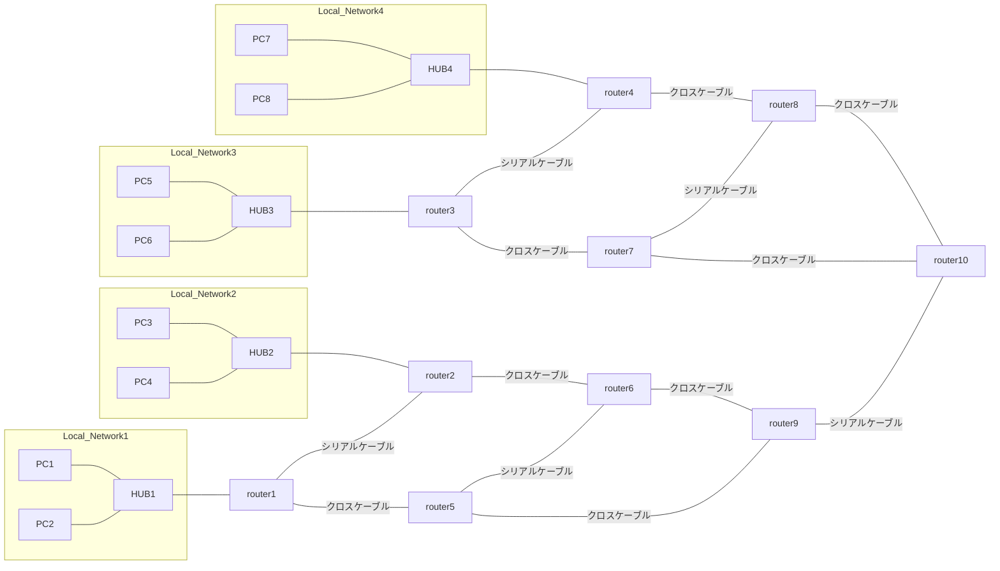
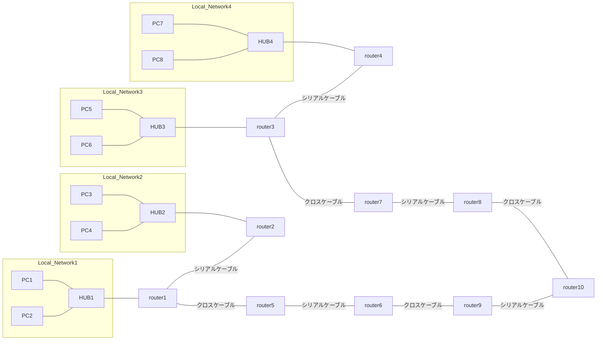

# 情報工学2 ~ルータの設定とルートの確認~

本実験は2回分（4時限分 × 2）を想定する。

実験レポートのファイル名は `T4情報工学2_[学生番号]_[氏名].pdf` とすること。

## 1. 目的
コンピュータネットワークにおいて、IPアドレス、ルータの役割を理解し、ルータの設定の仕方を学習し、ルータによるルーティングを確認する。

## 2. 理論、ルータ設定法
### 2.1 ルータの役割
ルータはローカルネットワークを相互接続するデバイスであり、宛先IPアドレスのネットワーク部を読み取り、どのネットワークにメッセージを転送すればもっとも効率的に宛先に届くかを判断する。
ルータには、ローカル接続ネットワークやリモートネットワークへメッセージを送信するためのルート(経路)情報が格納されたルーティングテーブルがある。

### 2.2 ルータの設定
パソコンとルータをコンソールケーブルで接続し、ターミナルを使ってルーターを設定する。

- ユーザ EXEC モード (`Router>`): デバイスの動作状態を調べる、`ping`、`traceroute` のみ可能。
- 特権 EXEC モード (`Router#`): `enable` コマンドで移行し、設定コマンドへのアクセスが可能。
- グローバル設定モード (`Router(config)#`): `configure terminal` コマンドで移行し、インターフェイス設定等を行う。

### 2.3 RIP (Routing Information Protocol)
パス選択のメトリックとしてホップカウントを使用するルーティングプロトコル。ルーティングテーブルの内容をデフォルトで30秒ごとに送信し、新しいルートの情報を隣接ルータに通知する。

#### 設定コマンド例

```text
Router(config)# router rip
Router(config-router)# network [network-number]
```

設定後、リモートネットワークのデバイスへ `ping` を実行したり、`show ip route` コマンドでルーティングテーブルを確認して動作を検証する。

## 3. 実験
### 3.1 ネットワークの設計
下記ネットワーク図を参考にしてネットワークアドレスとサブネットマスクを決定し、すべてのインターフェイスにIPアドレスを割り当てる。

### 3.2 PCのインターフェース設定
1. Linux を起動する（電源を入れて F9）。
2. イーサネットインターフェースに IP アドレス、デフォルトルートを設定する（付録を参照）。

### 3.3 ルータのインタフェース設定
1. PCのUSBポートとルーターのコンソールポートをコンソールケーブルで接続する。
2. ルーターのイーサネットポート(0)とハブを、自作のストレートケーブルで接続する。
3. PCとルータをコンソールケーブルで接続し、ターミナルで `cu -s 9600 -1 /dev/ttyUSB0` 等のコマンドで接続する。
4. ルータの電源を入れる。
5. Enterキーを押してプロンプト `Router>` が出ることを確認する。
6. インターフェースを確認する。

```text
show interface
```

`FastEthernet0/0`、`GigabitEthernet0/0`、`Serial0/0/0` などを確認する（スペースキーでページ送りされる）。
7. イーサネットインターフェースに IP アドレスを設定する（付録を参照）。

### 3.4 最終配線とルータ・PC設定
1. 各機器をストレートケーブルやシリアルケーブル、クロスケーブルで配線する。
2. 各自のルータから他のルーターへ `ping` で接続確認する。

### 3.5 RIP未設定状態での接続確認
`ping`コマンドで、直近のルータ、グループ内のすべてのルータ間、別ネットワークのPCへの到達性を確認する。
ここではまだRIPを設定しない。

### 3.6 RIP設定状態での接続確認
すべてのルータにRIPを設定する。
RIP情報がすべてのルータに行き渡るように数分待ってから `ping` で接続確認を行う。
`traceroute` を実行する。
`show ip route` を実行して各自のルーティングテーブルを記録する。

### 3.7 ケーブルを一部外して接続確認
ネットワークが一部不達になったことを想定してクロスケーブルを外し、同様に `traceroute` およびルーティングテーブルの変化を調べる。

## 4. 課題
1. 3回(3.5, 3.6, 3.7)の接続確認を表にまとめ、届かなかった場合はその理由を考えよ。
2. 2回(3.6, 3.7)の `traceroute` を比較せよ。
3. ルーティングテーブルを考察せよ。

## 5. 参考ネットワーク図

### 5.1 ネットワーク図(完全)


### 5.1 ネットワーク図(切断状態)

