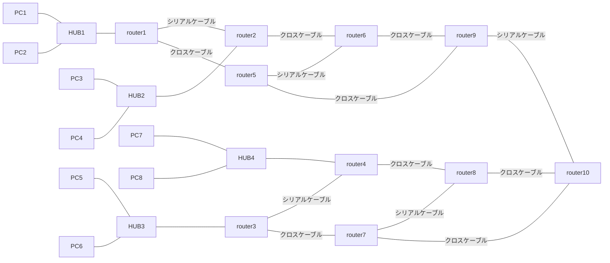

```mermaid
graph LR
    %% 端末とスイッチの接続
    PC1 --- HUB1
    PC2 --- HUB1
    PC3 --- HUB2
    PC4 --- HUB2
    PC5 --- HUB3
    PC6 --- HUB3
    PC7 --- HUB4
    PC8 --- HUB4

    %% スイッチとメインルーターの接続
    HUB1 --- router1
    HUB2 --- router2
    HUB3 --- router3
    HUB4 --- router4

    %% ルーター間の接続
    router1 -- シリアルケーブル --- router2
    router3 -- シリアルケーブル --- router4

    router1 -- クロスケーブル --- router5
    router2 -- クロスケーブル --- router6
    router3 -- クロスケーブル --- router7
    router4 -- クロスケーブル --- router8

    router5 -- シリアルケーブル --- router6
    router7 -- シリアルケーブル --- router8

    router5 -- クロスケーブル --- router9
    router6 -- クロスケーブル --- router9
    router7 -- クロスケーブル --- router10
    router8 -- クロスケーブル --- router10

    router9 -- シリアルケーブル --- router10
```